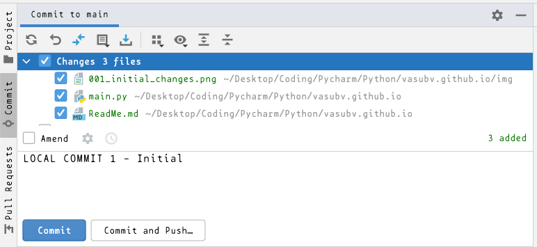

This project accomplishes the following :

1. Creates a repo on GIT - 'vasu.github.io' (Refer to /Users/vasu/Desktop/Coding/GIT/003. Working With GIT Repo.rtfd)

2. Add a ReadMe.md markdown file (Right Click on the project > New > File > ReadMe.md. Return)

3. The ReadMe.md is manually pushed to the GIT Hub Repo. (So don't add it to the repo at the time of creating the file)

4. In order to add ReadMe.md to GIT, first allow GIT to track this file (Right Click on File > Git > Add ) / CMD + Opt + A
   File turns Green & so GIT is tracking our ReadMe.md file

5. Ensure there is a Python Interpreter available for this project. 
   IDE & Project Settings > Preferences ... > Project : vasu.github.io > Python Interpreter > Show All 
   If it dint show up there in show all click the '+' button and select the latest Python (Python3.10) library from 
   the path (/Library/Frameworks/Python.framework/Versions/3.10/bin/python3.10), which can be found from the Terminal 
   command : which python3.10

6. Add main.py to the staging area for git to track (Cmd + Opt + A). main.py turns Green

7. goto the Commit tab : Commit > Changes. You should see both the files as having Changes. Note that its not yet 
   pushed to the remote GIT and GIT is tracking them. So they will be identified as Changes.

8. Add a new Directory 'img'. Add a screenshot of GIT_Changes in the img folder and add the changes screenshot
   image to GIT Staging. 

9. This initial state can be COMMITted to GIT, by selecting them in Commit > Changes, Select All the files with changes

10. Add a Commit Message - LOCAL COMMIT 1 - Initial. We can just Commit or Commit & Push to the Remote repo
    
    Lets just Commit these local changes. Hit the Commit button (CMD + K)
 

